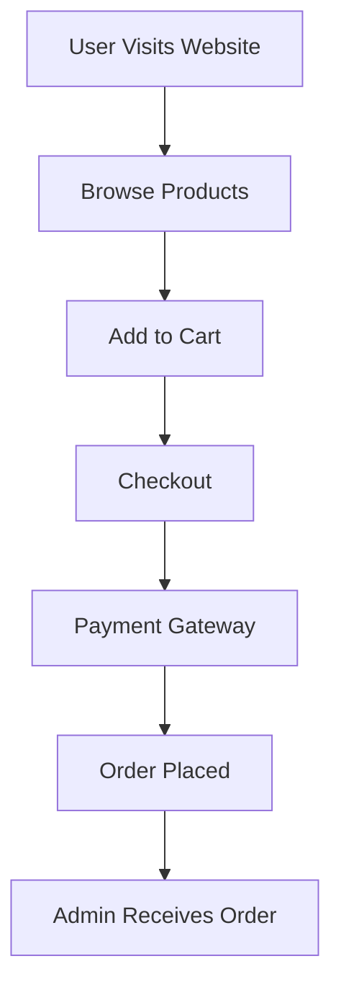
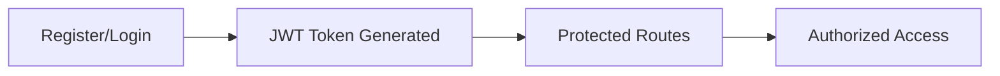
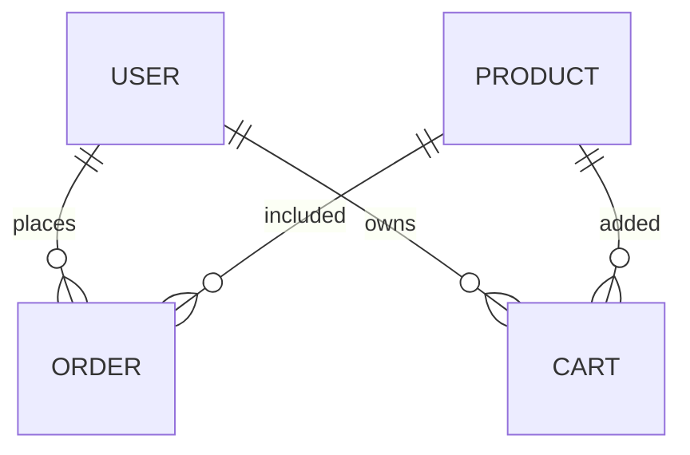

# 🛒 MERN E-Commerce Store

<div align="center">


<h3>✨ Modern Full Stack E-Commerce Store Built with MERN Stack ✨</h3>

<p>
A complete e-commerce platform with authentication, product management, cart system, secure checkout, admin dashboard, and responsive UI.
</p>

</div>

---

# 📌 Project Overview

This project is a full-featured **E-Commerce Web Application** developed using the **MERN Stack**:

* **MongoDB** → Database
* **Express.js** → Backend Framework
* **React.js** → Frontend Library
* **Node.js** → Server Runtime

The application allows users to:

✅ Browse products
✅ Search & filter products
✅ Add products to cart
✅ Place orders
✅ Make payments
✅ Manage profile
✅ Track orders
✅ Admin product management
✅ Admin order management

---

# 🌟 Features

# 👤 User Features

* 🔐 User Authentication (Login/Register)
* 🛍️ Product Browsing
* 🔎 Search Products
* 🧩 Filter by Category
* ❤️ Wishlist System
* 🛒 Shopping Cart
* 💳 Online Payment
* 📦 Order Tracking
* ⭐ Product Reviews & Ratings
* 👤 User Profile Management
* 📱 Fully Responsive UI

---

# 🛠️ Admin Features

* ➕ Add Products
* ✏️ Update Products
* ❌ Delete Products
* 📦 Manage Orders
* 👥 Manage Users
* 📊 Dashboard Analytics
* 📈 Sales Reports
* 🖼️ Upload Product Images

---

# 🧠 Tech Stack

<div align="center">

| Frontend      | Backend    | Database      | Authentication | Deployment |
| ------------- | ---------- | ------------- | -------------- | ---------- |
| React.js      | Node.js    | MongoDB       | JWT Auth       | Vercel     |
| Redux Toolkit | Express.js | Mongoose      | bcrypt.js      | Render     |
| Tailwind CSS  | REST API   | MongoDB Atlas | Cookies        | Netlify    |

</div>

---

# 🗂️ Project Structure

```bash
mern-ecommerce/
│
├── client/                     # Frontend React App
│   ├── public/
│   ├── src/
│   │   ├── components/
│   │   ├── pages/
│   │   ├── redux/
│   │   ├── services/
│   │   ├── assets/
│   │   ├── hooks/
│   │   ├── layouts/
│   │   └── App.jsx
│   └── package.json
│
├── server/                     # Backend Node Server
│   ├── controllers/
│   ├── models/
│   ├── routes/
│   ├── middleware/
│   ├── config/
│   ├── utils/
│   ├── uploads/
│   └── server.js
│
├── .env
├── README.md
└── package.json
```

---

# 🖼️ Application Preview

# 🏠 Home Page

```text
 ------------------------------------------------------
| LOGO | Search Products...             | Cart | User |
 ------------------------------------------------------
|                                                      |
|                🔥 Featured Products                  |
|                                                      |
|  [ Product ]   [ Product ]   [ Product ]             |
|                                                      |
 ------------------------------------------------------
```

---

# 🛒 Cart Page

```text
 -------------------------------------------------
| Product Name        Quantity       Price        |
|-------------------------------------------------|
| Nike Shoes             2           $120         |
| T-Shirt                1           $40          |
|-------------------------------------------------|
| Total                               $160        |
 -------------------------------------------------
```

---

# 📊 Admin Dashboard

```text
 ----------------------------------------------
| Total Users     | Total Orders | Revenue    |
|----------------------------------------------|
|      1200       |      430     |   $12K     |
 ----------------------------------------------
```

---

# 🔄 Application Flow



---

# 🔑 Authentication Flow



---

# 🧩 Modules Included

# 1️⃣ Authentication Module

### Features

* User Registration
* User Login
* Password Encryption
* JWT Authentication
* Forgot Password
* Reset Password
* Protected Routes

### Technologies Used

* JWT
* bcrypt.js
* Cookies
* Express Middleware

---

# 2️⃣ Product Module

### Features

* Add Product
* Update Product
* Delete Product
* Product Details
* Product Categories
* Product Search
* Product Filtering

### Database Fields

```js
{
  title: String,
  description: String,
  price: Number,
  category: String,
  stock: Number,
  image: String,
  ratings: Number
}
```

---

# 3️⃣ Cart Module

### Features

* Add to Cart
* Remove from Cart
* Quantity Update
* Price Calculation
* Checkout Process

---

# 4️⃣ Order Module

### Features

* Create Order
* Order History
* Track Order
* Update Order Status
* Admin Order Management

---

# 5️⃣ Payment Module

### Features

* Stripe Integration
* Secure Payments
* Payment Verification
* Checkout System

---

# 6️⃣ Admin Panel Module

### Features

* Dashboard Analytics
* User Management
* Product Management
* Order Management
* Sales Monitoring

---

# 🧪 API Endpoints

# 🔐 Auth Routes

```http
POST   /api/auth/register
POST   /api/auth/login
GET    /api/auth/profile
POST   /api/auth/logout
```

---

# 🛍️ Product Routes

```http
GET      /api/products
GET      /api/products/:id
POST     /api/products
PUT      /api/products/:id
DELETE   /api/products/:id
```

---

# 🛒 Cart Routes

```http
POST   /api/cart/add
GET    /api/cart
DELETE /api/cart/remove/:id
```

---

# 📦 Order Routes

```http
POST   /api/orders
GET    /api/orders/my-orders
PUT    /api/orders/:id
```

---

# ⚙️ Environment Variables

Create a `.env` file in the root directory.

```env
PORT=5000
MONGO_URI=your_mongodb_connection
JWT_SECRET=your_secret_key
STRIPE_SECRET_KEY=your_key
CLIENT_URL=http://localhost:5173
```

---

# 🚀 Installation Guide

# 1️⃣ Clone Repository

```bash
git clone https://github.com/your-username/mern-ecommerce.git
```

---

# 2️⃣ Install Backend Dependencies

```bash
cd server
npm install
```

---

# 3️⃣ Install Frontend Dependencies

```bash
cd client
npm install
```

---

# 4️⃣ Start Backend Server

```bash
npm run dev
```

---

# 5️⃣ Start Frontend

```bash
npm run dev
```

---

# 🗃️ Database Design



---

# 📱 Responsive Design

✅ Mobile Friendly
✅ Tablet Responsive
✅ Desktop Optimized
✅ Smooth UI Animations

---

# 🎨 UI/UX Features

* Modern Layout
* Clean Interface
* Dark/Light Mode
* Smooth Animations
* Skeleton Loading
* Toast Notifications
* Interactive Dashboard

---

# 🔒 Security Features

* Password Hashing
* JWT Authentication
* Protected APIs
* Role-Based Access
* Secure Payment Handling
* Environment Variables Protection

---

# ☁️ Deployment

# Frontend Deployment

* Vercel
* Netlify

# Backend Deployment

* Render
* Railway

# Database Hosting

* MongoDB Atlas

---

# 📈 Future Improvements

* 🤖 AI Product Recommendations
* 🌍 Multi-language Support
* 📲 Mobile App Version
* 💬 Live Chat Support
* 🔔 Push Notifications
* 🎟️ Coupon System
* 📦 Inventory Management
* 🧠 Advanced Analytics

---

# 📚 Learning Goals

This project helps in learning:

* Full Stack Development
* REST APIs
* Authentication Systems
* Database Design
* State Management
* Payment Integration
* Deployment Process
* Clean Code Structure

---

# 🤝 Contribution Guide

```bash
# Fork the repository
# Create new branch
# Commit changes
# Push changes
# Create Pull Request
```

---

# 📸 Suggested Screenshots

You can later add:

```md


```

---

# 🧑‍💻 Developer

## Developed By

**Your Name**

### Connect With Me

* GitHub
* LinkedIn
* Portfolio Website

---

# ⭐ Support

If you like this project:

🌟 Star the repository
🍴 Fork the project
📢 Share with others

---

# 📄 License

This project is licensed under the MIT License.

---

<div align="center">

# ❤️ Thank You For Visiting

### Happy Coding 🚀

</div>
